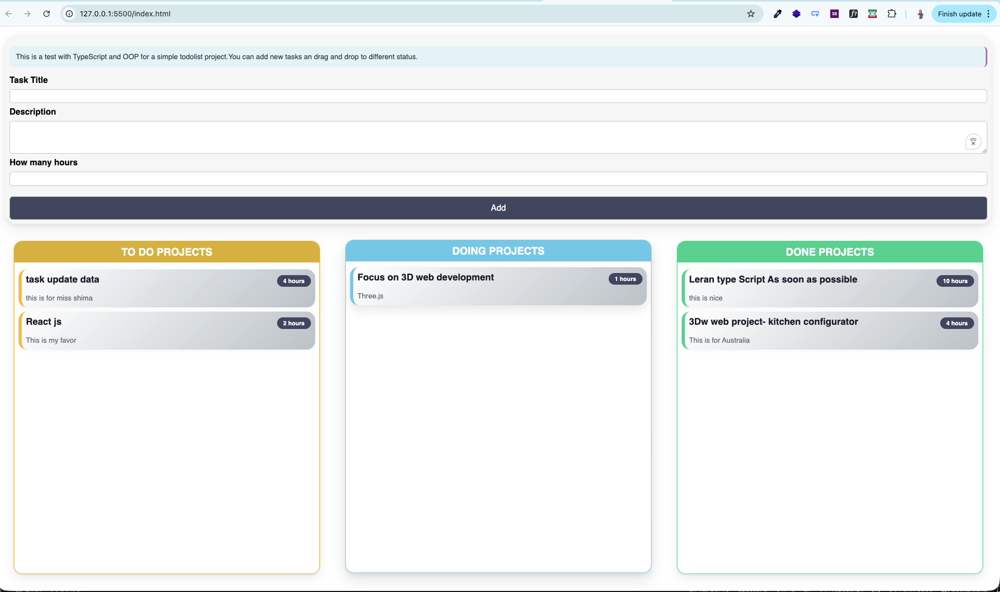

# 🧩 TS-OOP-Modular Task Manager

[](https://www.typescriptlang.org/)
[]()
[]()
[]()

A **Task Manager** built with **TypeScript** and **Object-Oriented Programming** principles.  
You can add, drag & drop tasks between different status columns: **To Do → Doing → Done**.

---
## 📸 Screenshot




## ✨ Features

- ✅ Add new tasks with **title**, **description**, and **hours**
- ✅ Form **validation** for inputs (minLength, maxLength, required, min, max)
- ✅ **Drag & Drop** between 3 columns (To Do, Doing, Done)
- ✅ Clean **OOP architecture**:
  - **Singleton** pattern (`ProjectState`)
  - **Observer** pattern (listeners for UI updates)
  - **Component-based** UI with Generics
  - **Interfaces** for Draggable & DragTarget
- ✅ Custom **@autobind** decorator for event handlers
- ✅ Fully **modular** with **ES Modules**
- ✅ **TypeScript Strict Mode** (no `any` type)

---

## 🛠️ Tech Stack

| Technology | Usage |
|------------|-------|
| TypeScript | Strict mode, Generics, Interfaces, Union Types |
| OOP | Inheritance, Encapsulation, Polymorphism |
| Drag & Drop API | Native HTML5 Drag & Drop |
| ES Modules | Modular architecture |
| CSS3 | Flexbox, Grid, Modern styling, Animations |

---


## 🚀 How to Run

```bash
# 1. Clone the repository
git clone https://github.com/shahbaziparisa/ts-oop-task-manager.git

# 2. Navigate to project folder
cd ts-oop-modular-task-manager

# 3. Install TypeScript (if not installed globally)
npm install -g typescript

# 4. Compile TypeScript
tsc

# 5. Open index.html in your browser
# Or use Live Server extension for better experience

---

User Input (Form)
       ↓
ProjectInput (Validation)
       ↓
ProjectState.addProject()  ← [Singleton]
       ↓
updateListeners()
       ↓
ProjectList (ToDo) ← ProjectList (Doing) ← ProjectList (Done)
       ↓
ProjectItem (Render each task)
       ↓
Drag & Drop between columns
       ↓
ProjectState.moveProject()
       ↓
UI updates automatically (Observer)

---

